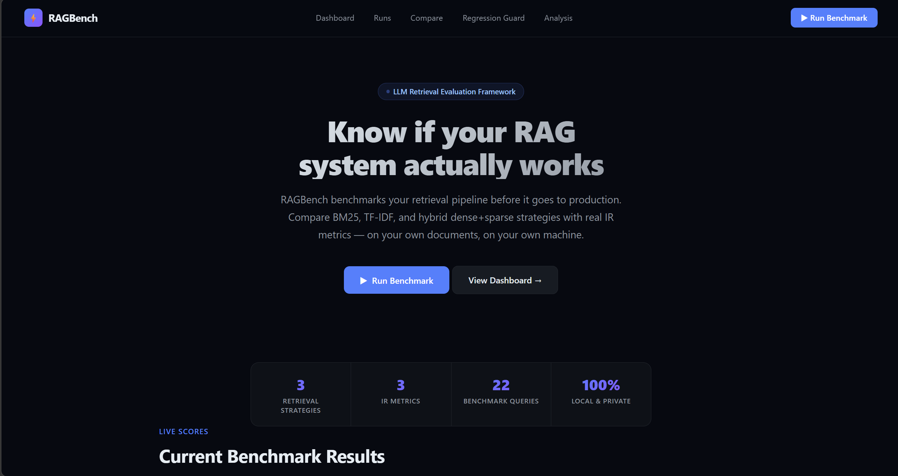
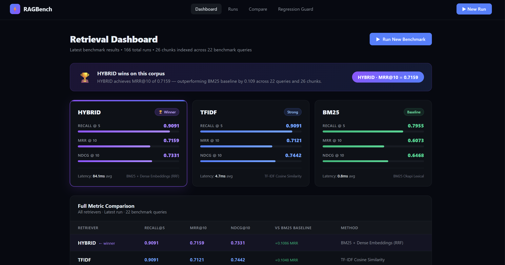
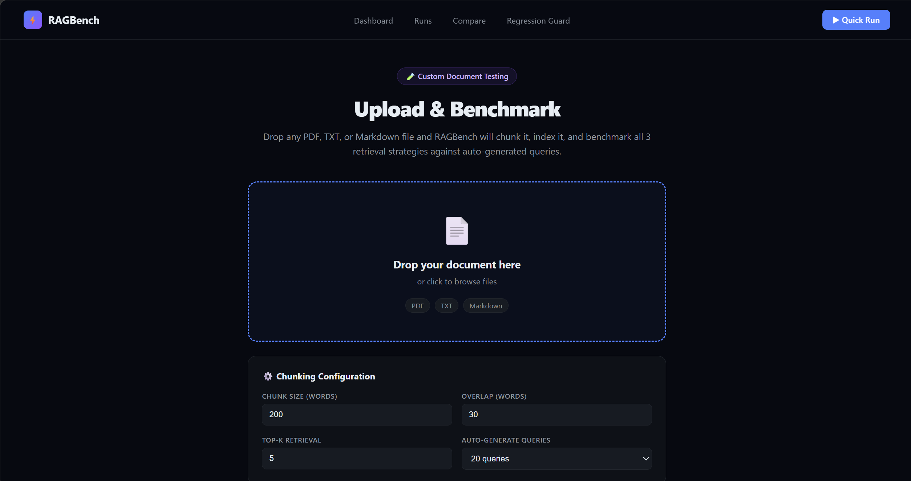
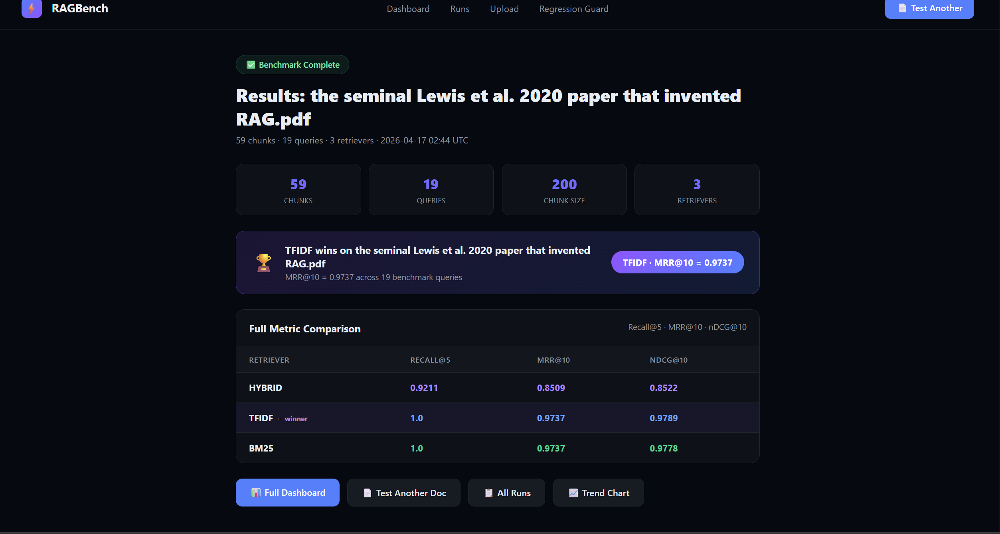
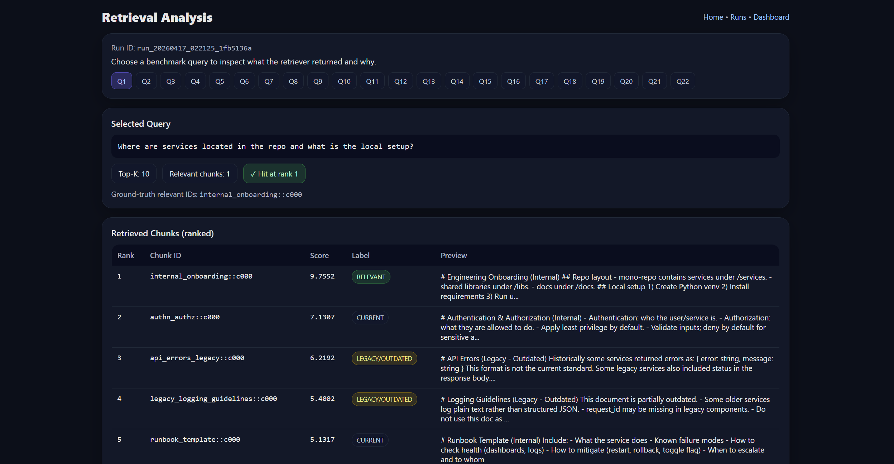
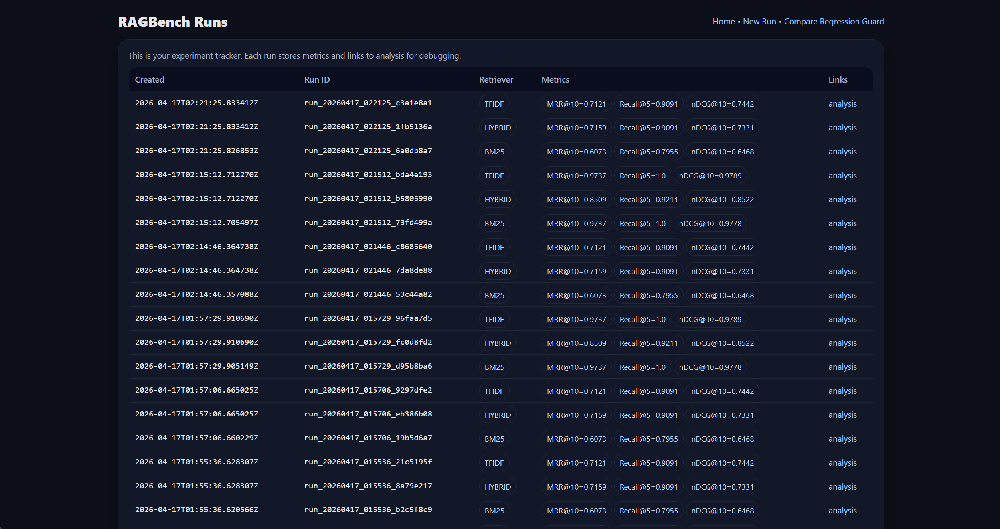

# RAGBench

> **Know if your RAG system actually works — before it ships.**

A local, zero-setup evaluation framework that benchmarks three retrieval strategies — **BM25**, **TF-IDF**, and **Hybrid dense+sparse** — on your own documents using industry-standard IR metrics (Recall@k, MRR@k, nDCG@k).

---



---

## The problem

Most RAG failures aren't LLM failures — they're **retrieval failures**. The model confidently answers from the wrong chunks.

Teams deploy RAG pipelines without measuring whether their retriever actually finds the right documents. They pick BM25 because it's simple, or a dense model because it sounds modern, without comparing them on their own corpus.

**RAGBench fixes that.** Upload your documents, and in under a minute you get a verdict: *for your data, here's which retriever wins, by how much, and where each one fails.*

---

## What it does

- **Evaluates three retrievers** against ground-truth queries on your corpus:
  - **BM25** — classical sparse lexical retrieval (`rank_bm25`)
  - **TF-IDF** — sparse vector retrieval with cosine similarity (`scikit-learn`)
  - **Hybrid** — BM25 + dense semantic (sentence-transformers + FAISS) fused via Reciprocal Rank Fusion
- **Computes three IR metrics** per retriever:
  - **Recall@5** — did we find the right document in the top 5?
  - **MRR@10** — how high up the list is the first correct document?
  - **nDCG@10** — weighted quality of the full ranking
- **Logs every run** to SQLite for experiment tracking, trend analysis, and regression detection
- **Runs locally** — no API keys, no cloud calls, no data leaving your machine

---

## Live results on the built-in corpus

| Retriever | Recall@5 | MRR@10 | nDCG@10 |
|-----------|----------|--------|---------|
| **HYBRID** ⭐ | **0.909** | **0.716** | 0.733 |
| TF-IDF | 0.909 | 0.712 | 0.744 |
| BM25 | 0.796 | 0.607 | 0.647 |

**Hybrid retrieval beats BM25 by 18% on MRR@10** on the built-in benchmark — exactly the kind of uplift that separates a RAG demo from a production system.



---

## Bring your own documents

Drop any PDF, TXT, or Markdown file. RAGBench will chunk it, build all three retrieval indexes on your corpus, auto-generate benchmark queries from its content, and produce a head-to-head comparison.





---

## Failure analysis

Every run comes with query-level drill-down. See which chunks the retriever returned for a given question, which were actually relevant, where the hit landed in the ranking, and why a miss happened.



---

## Experiment tracker

Every benchmark run is persisted with its full config. Compare runs over time, detect regressions when you tune chunk size or swap embedding models.



---

## Architecture
┌─────────────────────────────────────────────────────────────┐
│                       FastAPI Frontend                      │
│   /  /dashboard  /runs  /analysis  /upload  /regression     │
└──────────────────────────┬──────────────────────────────────┘
│
┌──────────────────────────▼──────────────────────────────────┐
│                     Retrieval Layer                         │
│   ┌─────────┐   ┌─────────┐   ┌──────────────────────┐      │
│   │  BM25   │   │ TF-IDF  │   │  Hybrid (BM25+Dense) │      │
│   │ rank_bm25│   │ sklearn │   │   FAISS + MiniLM     │      │
│   └────┬────┘   └────┬────┘   └──────────┬───────────┘      │
└────────┼─────────────┼───────────────────┼──────────────────┘
│             │                   │
┌────────▼─────────────▼───────────────────▼──────────────────┐
│                    Evaluation Engine                        │
│        Recall@k · MRR@k · nDCG@k · RRF Fusion               │
└──────────────────────────┬──────────────────────────────────┘
│
┌──────────────────────────▼──────────────────────────────────┐
│                SQLite — Runs + Metrics Store                │
└─────────────────────────────────────────────────────────────┘

---

## Tech stack

**Backend:** FastAPI · Uvicorn · Python 3.10
**Retrieval:** `rank_bm25` · `scikit-learn` · `sentence-transformers` (all-MiniLM-L6-v2, 384-dim) · FAISS
**Storage:** SQLite
**Frontend:** Jinja2 templates · Plotly
**Metrics:** custom IR implementations — Recall@k, MRR@k, nDCG@k

---

## Quick start

```bash
# Clone
git clone https://github.com/PavanUDD/RAGBench.git
cd RAGBench

# Set up environment
python -m venv venv
venv\Scripts\activate        # Windows
# source venv/bin/activate   # Mac/Linux
pip install -r requirements.txt

# Run
python -m uvicorn app.main:app --reload
```

Open [http://127.0.0.1:8000](http://127.0.0.1:8000) in your browser.

First startup takes ~10 seconds while the sentence-transformer model warms up.

---

## Project layout
app/
├── main.py              # FastAPI app + startup model caching
├── core/
│   ├── retrieval.py     # BM25 retriever
│   ├── tfidf.py         # TF-IDF retriever
│   ├── dense.py         # Dense + FAISS retriever
│   ├── hybrid.py        # BM25 + Dense fused via RRF
│   ├── metrics.py       # Recall@k · MRR@k · nDCG@k
│   ├── benchmarks.py    # Ground-truth query sets
│   ├── ingest.py        # Chunking + document loading
│   └── extractor.py     # PDF/TXT/MD text extraction
├── routes/
│   ├── home.py          # Landing page
│   ├── dashboard.py     # Metrics visualization
│   ├── runs.py          # Experiment tracker
│   ├── analysis.py      # Per-query drill-down
│   ├── compare.py       # Side-by-side run comparison
│   ├── regression.py    # Regression guard
│   └── upload.py        # Bring-your-own-PDF benchmarking
├── templates/           # Jinja2 templates
└── db/                  # SQLite init + connection

---

## Honest limitations & roadmap

Because a portfolio project that doesn't acknowledge its gaps isn't serious.

**Current scope:**
- Single-user, local deployment
- Evaluation relies on auto-generated queries from the uploaded document itself — this creates lexical overlap bias that can favor sparse retrievers (BM25/TF-IDF) on verbatim matches
- Built-in benchmark corpus is a hand-crafted set of 26 internal-docs-style chunks for demonstrating methodology
- No authentication or multi-tenancy

**Planned next:**
- [ ] Evaluation on public IR benchmarks (BEIR subset, MS MARCO)
- [ ] Paraphrased query generation for more realistic retrieval evaluation
- [ ] PDF export of benchmark reports
- [ ] Authentication + per-user run isolation
- [ ] Docker deployment
- [ ] LLM-as-judge evaluation (faithfulness, answer relevance)

---

## Why I built this

I'm an ML/AI Engineer focused on production RAG systems. I kept seeing teams debug hallucinations by blaming the LLM — when the real problem was upstream, in the retrieval layer. RAGBench is the tool I wished I'd had: something that answers *"which retrieval strategy should I deploy on my actual documents"* in under a minute, without any external dependencies.

---

## About

Built by **Pavan Devara** — AI/ML Engineer, San Antonio TX
MS Computer Science, Texas A&M University – Corpus Christi
AWS Certified (Solutions Architect Associate · AI Practitioner · Cloud Practitioner)

[LinkedIn](https://linkedin.com/in/pavan-devara) · [GitHub](https://github.com/PavanUDD)